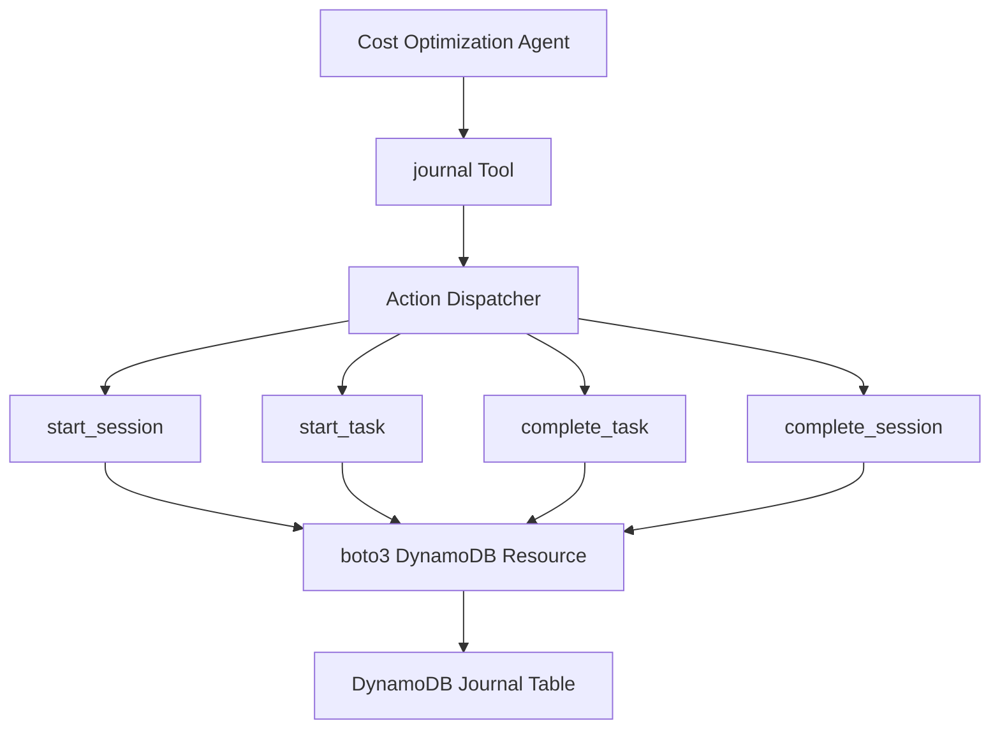

# Design Document

## Overview

This design creates a unified Strands tool that encapsulates DynamoDB journaling operations for the cost optimization agent through a single action-based interface. Instead of multiple separate tool functions, the implementation provides a single `journal()` tool that dispatches to different operations based on an `action` parameter. This approach simplifies the agent interface while maintaining clean separation of concerns.

The tool automatically retrieves the session ID from the invocation state and leverages `boto3.resource()` for DynamoDB operations, following Strands best practices for tool development with comprehensive error handling.

## Architecture

### Unified Tool Architecture



### Design Principles

1. **Single Tool Interface**: One `journal()` tool with action-based dispatch for simplicity
2. **Context-Driven Session Management**: Session ID is passed through the agent's invocation state, eliminating the need for the agent to manually track or pass session identifiers
3. **Error Handling**: Comprehensive error handling with consistent response format
4. **Type Safety**: Enums for status values and type hints throughout

## Components and Interfaces

### Unified Tool Interface

#### journal(action, tool_context, phase_name=None, status=None, error_message=None)

Single tool function with action-based dispatch:

**Parameters:**
- `action` (str): Operation to perform - "start_session", "start_task", "complete_task", "complete_session"
- `tool_context` (ToolContext): Strands context providing invocation state
- `phase_name` (Optional[str]): Task/phase name (required for task operations)
- `status` (Optional[str]): Completion status (TaskStatus or SessionStatus enum values)
- `error_message` (Optional[str]): Error details for failed operations

**Actions:**

1. **start_session**: Initialize new session using session_id from invocation state
   - Retrieves session_id from `tool_context.invocation_state`
   - Creates SESSION record in DynamoDB

2. **start_task**: Begin tracking a task/phase
   - Requires `phase_name` parameter
   - Creates TASK record with timestamp-based sort key

3. **complete_task**: Finalize task with status
   - Requires `phase_name` parameter
   - Accepts status: COMPLETED, FAILED, CANCELLED, SKIPPED
   - Calculates duration and updates DynamoDB

4. **complete_session**: Finalize session with status
   - Accepts status: COMPLETED, FAILED
   - Calculates total duration

### boto3 Integration

#### DynamoDB Resource API
```python
import boto3
from botocore.exceptions import ClientError

# Initialize DynamoDB resource
dynamodb = boto3.resource("dynamodb")

```

#### Error Handling
All DynamoDB operations wrapped in try/except blocks:
- `ClientError`: Extracted error code and message for context
- Generic `Exception`: Caught for unexpected errors
- No retry logic (simplified from original design)

#### Response Format
Consistent response structure:
```python
# Success
{
    "success": True,
    "session_id": str,
    "timestamp": str,
    "status": str,
    # ... operation-specific fields
}

# Error
{
    "success": False,
    "error": str,
    "timestamp": str,
    # ... optional context fields
}
```

## Data Models

### DynamoDB Schema

The existing schema is well-designed and follows DynamoDB best practices:

**Table Structure:**
- **Partition Key**: `session_id` (String)
- **Sort Key**: `record_type#timestamp` (String)
- **GSI**: `status-date-index` (status, timestamp)

**Record Types:**

1. **Session Record**
   ```json
   {
     "session_id": "session_20250108_143022",
     "record_type": "SESSION",
     "timestamp": "2025-01-08T14:30:22Z",
     "status": "STARTED|COMPLETED|FAILED",
     "start_time": "2025-01-08T14:30:22Z",
     "end_time": "2025-01-08T14:35:45Z",
     "duration_seconds": 323,
     "ttl": 1738766222
   }
   ```

2. **Task Record**
   ```json
   {
     "session_id": "session_20250108_143022",
     "record_type": "TASK#2025-01-08T14:30:25Z",
     "timestamp": "2025-01-08T14:30:25Z",
     "status": "IN_PROGRESS|COMPLETED|FAILED",
     "phase_name": "Discovery|Analysis|...",
     "start_time": "2025-01-08T14:30:25Z",
     "end_time": "2025-01-08T14:31:10Z",
     "duration_seconds": 45,
     "error_message": null,
     "ttl": 1738766222
   }
   ```

### Data Access Patterns

Efficient access patterns for journaling operations:

1. **Create Session**: Insert item with session_id partition key and "SESSION" sort key
2. **Update Session**: Update item using session_id and "SESSION" sort key to set completion status and duration
3. **Create Task**: Insert item with session_id partition key and "TASK#timestamp" sort key
4. **Update Task**: Update item using session_id and "TASK#timestamp" sort key to set completion status and duration
5. **Find Task by Phase**: Query items by session_id with sort key prefix filter when needed

## Error Handling

### Error Strategy

Simplified error handling without retry logic:
- All DynamoDB operations wrapped in try/except blocks
- `ClientError` exceptions caught and formatted with error code/message
- Generic `Exception` caught for unexpected errors
- Errors returned as structured responses, not raised

### Error Types

Common error scenarios:

- **NO_SESSION**: No active session found in invocation state
- **TASK_NOT_FOUND**: Task not found in DynamoDB
- **Missing Configuration**: JOURNAL_TABLE_NAME not set
- **DynamoDB Errors**: ClientError with AWS error codes
- **Validation Errors**: Missing required parameters (phase_name, etc.)

### Error Response Format

Consistent error structure:

```python
{
    "success": False,
    "error": "Error message with context",
    "timestamp": "ISO8601 timestamp",
    # Optional context fields
    "error_type": "NO_SESSION",
    "session_id": "...",
    "phase_name": "..."
}
```

## Implementation Notes

### Key Implementation Details

1. **Single Tool with Action Dispatch**: One `@tool` decorated function handles all operations via action parameter
2. **Context-Driven Session Management**: Session ID is retrieved from `tool_context.invocation_state`, which is set by the agent during initialization, allowing the tool to automatically associate all operations with the current agent execution.
3. **boto3 Resource API**: Uses `boto3.resource("dynamodb")` for cleaner syntax vs client API
4. **Status Enums**: TaskStatus and SessionStatus enums for type safety
5. **No Table Check**: Removed check_table_exists functionality for simplicity

### Agent Integration

- Adds journal to agent tools list
- Generates unique session_id with timestamp and UUID
- Passes session_id to agent via invocation state.


### AWS Integration
- Uses standard `boto3` credential chain (environment variables, IAM roles, etc.)
- Requires DynamoDB permissions: PutItem, UpdateItem, Query, GetItem
- Environment variable: `JOURNAL_TABLE_NAME` (required)
- DynamoDB resource initialization: `boto3.resource("dynamodb")`