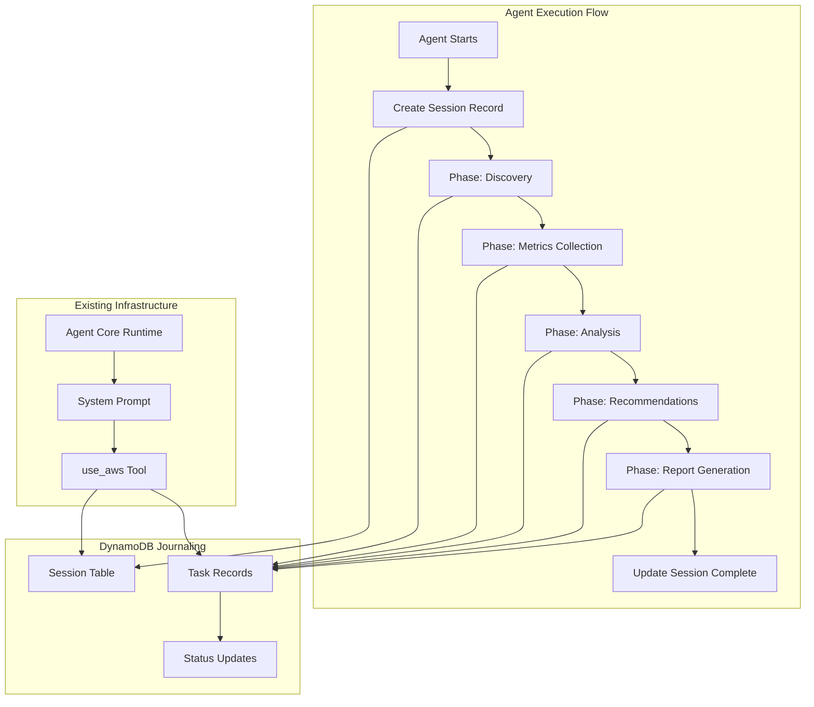

# Design Document

## Overview

The DynamoDB journaling feature will be implemented primarily through system prompt modifications that instruct the agent to use the existing `use_aws` tool for tracking workflow phases and their statuses. This approach leverages the agent's existing AWS capabilities without requiring additional code infrastructure, making it a lightweight and maintainable solution. The agent will create and update DynamoDB records as it progresses through its cost optimization workflow phases.

## Architecture



The design maintains the existing architecture while adding journaling instructions to the system prompt that guide the agent to use DynamoDB operations via the `use_aws` tool.

## Components and Interfaces

### System Prompt Modifications

**Purpose:** Add journaling instructions to the existing system prompt that guide the agent through DynamoDB operations for session and task tracking.

**Key Additions:**

- **Session Management Instructions:** Create session record at start, update at completion
- **Phase Tracking Instructions:** Create task records for each workflow phase with status updates
- **DynamoDB Schema Instructions:** Define table structure and required attributes
- **Error Handling Instructions:** Continue execution even if journaling fails
- **Query Support Instructions:** Enable session and phase status retrieval for monitoring
- **Performance Metrics Instructions:** Track timing and resource counts for analysis

**Integration Approach:**

- Extend existing system prompt with journaling workflow instructions
- Use existing `<session_id>` variable for session tracking (already used for S3 paths)
- Leverage existing 8 workflow phases already defined in the DETERMINISTIC WORKFLOW section
- Maintain existing S3 reporting while adding DynamoDB tracking
- Follow existing error handling pattern: continue execution despite journaling failures
- Add environment variable reference for configurable table name (JOURNAL_TABLE_NAME)
- Include table creation logic if table doesn't exist (Requirement 1.4)

### DynamoDB Table Schema

**Table Name:** `agent-cost-optimization-journal` (configurable via JOURNAL_TABLE_NAME environment variable)

**Primary Key Structure:**
- **Partition Key:** `session_id` (String) - Unique identifier for each cost optimization session
- **Sort Key:** `record_type#timestamp` (String) - Combines record type (SESSION/TASK) with ISO timestamp for chronological ordering

**Global Secondary Index (GSI):**
- **GSI Name:** `status-date-index`
- **Partition Key:** `status` (String) - Enables querying by status across sessions
- **Sort Key:** `timestamp` (String) - Enables date range queries for performance analysis

**Attributes:**

- `session_id` (String) - Session identifier
- `record_type` (String) - "SESSION" or "TASK"
- `timestamp` (String) - ISO 8601 timestamp
- `status` (String) - "STARTED", "IN_PROGRESS", "COMPLETED", "FAILED"
- `phase_name` (String) - For TASK records: "Discovery", "Metrics Collection", "Analysis", "Recommendations", "Report Generation"
- `start_time` (String) - ISO timestamp when phase started
- `end_time` (String) - ISO timestamp when phase completed
- `duration_seconds` (Number) - Calculated duration for completed phases
- `resource_count` (Number) - Number of resources processed in phase
- `error_message` (String) - Error details for failed phases
- `ttl` (Number) - Unix timestamp for automatic record expiration (30 days)

**Design Rationale:**
- GSI enables efficient querying by status and date ranges for performance analysis (Requirement 5.2)
- Consistent attribute naming and data types support reliable querying (Requirement 5.3)
- TTL settings provide automatic data retention management (Requirement 5.4)

### Workflow Phase Integration

**Existing Workflow Phases (from current prompt):**
1. **Discovery (Inventory)** - Enumerate Lambda, API Gateway, DynamoDB, S3, Step Functions, EventBridge
2. **Usage and Metrics Collection** - Collect CloudWatch metrics and logs (30-day + 7-day windows)
3. **Analysis and Decision Rules** - Apply cost optimization logic consistently
4. **Recommendation Format** - Generate specific recommendations with evidence
5. **Cost Estimation Method** - Calculate projected savings with pricing data
6. **Output Contract** - Generate structured plain text report
7. **S3 Write Requirements** - Save cost_report.txt and evidence.txt files
8. **Error Handling and Fallbacks** - Continue execution despite failures

**Real-Time Status Updates:**
- Each phase will immediately update DynamoDB when starting with "IN_PROGRESS" status (Requirement 4.1)
- Each phase will immediately update DynamoDB when completing with "COMPLETED" status (Requirement 4.2)
- Failed phases will immediately update DynamoDB with "FAILED" status and error message (Requirement 4.3)
- All status changes include precise timestamps for chronological tracking (Requirement 4.4)

**Journaling Integration Points:**
- Add DynamoDB operations at the start and end of each phase
- Use existing phase names and structure
- Maintain existing workflow logic while adding tracking
- Support querying sessions in progress to see completed vs running phases (Requirement 3.2)

## Data Models

### Session Record Model

```json
{
  "session_id": "session_20250108_143022_abc123",
  "record_type": "SESSION",
  "timestamp": "2025-01-08T14:30:22Z",
  "status": "STARTED|COMPLETED|FAILED",
  "start_time": "2025-01-08T14:30:22Z",
  "end_time": "2025-01-08T14:35:45Z",
  "duration_seconds": 323,
  "ttl": 1738766222
}
```

**Session Lifecycle:**
- Created at workflow start with "STARTED" status and session ID (Requirement 1.1, 1.2)
- Updated to "COMPLETED" status with end timestamp when workflow finishes (Requirement 1.3)
- Includes total session duration for performance analysis (Requirement 6.3)

### Task Record Model

```json
{
  "session_id": "session_20250108_143022_abc123",
  "record_type": "TASK#2025-01-08T14:30:25Z",
  "timestamp": "2025-01-08T14:30:25Z",
  "status": "IN_PROGRESS|COMPLETED|FAILED",
  "phase_name": "Discovery",
  "start_time": "2025-01-08T14:30:25Z",
  "end_time": "2025-01-08T14:31:10Z",
  "duration_seconds": 45,
  "resource_count": 12,
  "error_message": null,
  "ttl": 1738766222
}
```

**Task Lifecycle:**
- Created when phase starts with "IN_PROGRESS" status (Requirement 2.1)
- Updated to "COMPLETED" with timing metrics when phase succeeds (Requirement 2.2, 6.1, 6.2)
- Updated to "FAILED" with error message when phase fails (Requirement 2.3)
- Supports all standard workflow phases (Requirement 2.4)
- Enables chronological ordering and progress tracking (Requirement 3.4)

## Error Handling

**Prompt-Based Error Handling:**
- Instructions to continue cost optimization workflow even if DynamoDB operations fail
- Retry logic instructions for DynamoDB operations (up to 3 attempts)
- Fallback behavior to log errors but not halt execution
- Clear separation between core functionality and journaling

**Error Scenarios:**

- DynamoDB table doesn't exist → Create table then retry operation
- DynamoDB operation fails → Log error and continue with next phase
- Network/permission issues → Retry with exponential backoff, then continue

**Query and Monitoring Support:**
- Support querying by session ID to retrieve complete session summary (Requirement 3.1)
- Enable monitoring of sessions in progress to see completed vs running phases (Requirement 3.2)
- Provide error visibility for failed phases with specific error messages (Requirement 3.3)
- Maintain chronological ordering of phases with timestamps (Requirement 3.4)


## Implementation Strategy

### Phase 1: System Prompt Enhancement
- Add DynamoDB journaling instructions to existing system prompt
- Define table schema and operation patterns
- Integrate with existing workflow phases
- Add error handling and retry logic instructions

### Phase 2: Testing and Refinement
- Deploy updated prompt to existing infrastructure
- Test with sample cost optimization requests
- Refine journaling instructions based on actual behavior
- Validate that core functionality remains intact

### Deployment Approach

**No Infrastructure Changes Required:**
- Use existing CDK stack and Agent Core runtime
- Leverage existing `use_aws` tool capabilities
- Update only the system prompt file (`src/agents/prompt.md`)
- Deploy through existing agent update mechanism

**Rollback Strategy:**
- Keep backup of original system prompt
- Simple file replacement to revert changes
- No infrastructure rollback needed since no new resources are created