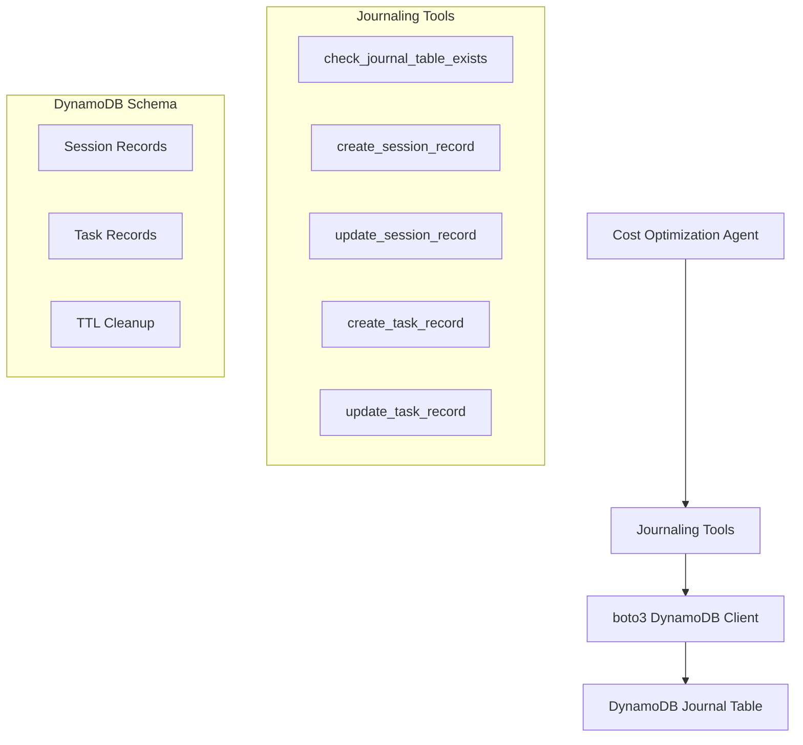

# Design Document

## Overview

This design creates a set of Strands tools that encapsulate DynamoDB journaling operations for the cost optimization agent. The current agent prompt contains extensive DynamoDB operations embedded directly in the workflow instructions, making it complex and difficult to maintain. By extracting these operations into dedicated tools using the `@tool` decorator, we achieve better separation of concerns, improved maintainability, and cleaner agent prompts.

The design leverages the existing DynamoDB schema and operations but abstracts them behind simple, semantic interfaces that the agent can call without understanding AWS API details. The tools will use `boto3` directly for DynamoDB operations and follow Strands best practices for tool development.

## Architecture

### Current State Analysis

The existing implementation already includes comprehensive journaling tools in `src/tools/journaling_tool.py` that:
- Use the `use_aws` tool for DynamoDB operations
- Implement comprehensive error handling with retry logic
- Follow proper DynamoDB schema patterns
- Include detailed documentation and type hints

### Target Architecture



### Design Principles

1. **Minimal Changes**: Leverage existing tool structure and only replace `use_aws` calls with `boto3`
2. **Backward Compatibility**: Maintain existing function signatures and response formats
3. **Error Handling**: Preserve comprehensive error handling and retry logic
4. **Documentation**: Keep concise docstrings focused on essential information
5. **Type Safety**: Maintain existing type hints and validation

## Components and Interfaces

### Tool Functions

The design maintains the existing five core tools with updated implementations:

#### 1. check_journal_table_exists()
- **Purpose**: Verify DynamoDB table accessibility before journaling operations
- **Current Implementation**: Uses `use_aws` with DescribeTable operation
- **New Implementation**: Direct `boto3` DynamoDB client call
- **Interface**: No changes to function signature or response format

#### 2. create_session_record(session_id: str, status: str = "STARTED")
- **Purpose**: Create session tracking records at workflow start
- **Current Implementation**: Uses `use_aws` with PutItem operation
- **New Implementation**: Direct `boto3` DynamoDB client call
- **Interface**: No changes to function signature or response format

#### 3. update_session_record(session_id: str, status: str, start_time: str, error_message: Optional[str] = None)
- **Purpose**: Update session completion status and calculate duration
- **Current Implementation**: Uses `use_aws` with UpdateItem operation
- **New Implementation**: Direct `boto3` DynamoDB client call
- **Interface**: No changes to function signature or response format

#### 4. create_task_record(session_id: str, phase_name: str)
- **Purpose**: Create task records for individual workflow phases
- **Current Implementation**: Uses `use_aws` with PutItem operation
- **New Implementation**: Direct `boto3` DynamoDB client call
- **Interface**: No changes to function signature or response format

#### 5. update_task_record(session_id: str, task_timestamp: str, status: str, error_message: Optional[str] = None)
- **Purpose**: Update task completion status without resource count tracking
- **Current Implementation**: Uses `use_aws` with UpdateItem operation
- **New Implementation**: Direct `boto3` DynamoDB client call
- **Interface**: Remove resource_count parameter from function signature

### boto3 Integration Layer

#### DynamoDB Client Management
```python
import boto3
from botocore.exceptions import ClientError, BotoCoreError

# Initialize DynamoDB client with proper session management
dynamodb = boto3.client('dynamodb')
```

#### Error Mapping
Map boto3 exceptions to existing error response format:
- `ClientError` with `ResourceNotFoundException` → `TABLE_NOT_FOUND`
- `ClientError` with `AccessDeniedException` → `ACCESS_DENIED`
- `ClientError` with `ConditionalCheckFailedException` → `DUPLICATE_SESSION/CONDITION_FAILED`
- `ClientError` with `ValidationException` → `VALIDATION_ERROR`
- Network/timeout exceptions → Retryable errors

#### Response Format Preservation
Maintain existing response structure:
```python
# Success response
{
    "success": True,
    "session_id": str,
    "timestamp": str,
    # ... other fields
}

# Error response
{
    "success": False,
    "error": str,
    "timestamp": str,
    "error_type": str,
    # ... context fields
}
```

## Data Models

### DynamoDB Schema (Unchanged)

The existing schema is well-designed and follows DynamoDB best practices:

**Table Structure:**
- **Partition Key**: `session_id` (String)
- **Sort Key**: `record_type#timestamp` (String)
- **GSI**: `status-date-index` (status, timestamp)

**Record Types:**

1. **Session Record**
   ```json
   {
     "session_id": "session_20250108_143022",
     "record_type": "SESSION",
     "timestamp": "2025-01-08T14:30:22Z",
     "status": "STARTED|COMPLETED|FAILED",
     "start_time": "2025-01-08T14:30:22Z",
     "end_time": "2025-01-08T14:35:45Z",
     "duration_seconds": 323,
     "ttl": 1738766222
   }
   ```

2. **Task Record**
   ```json
   {
     "session_id": "session_20250108_143022",
     "record_type": "TASK#2025-01-08T14:30:25Z",
     "timestamp": "2025-01-08T14:30:25Z",
     "status": "IN_PROGRESS|COMPLETED|FAILED",
     "phase_name": "Discovery|Analysis|...",
     "start_time": "2025-01-08T14:30:25Z",
     "end_time": "2025-01-08T14:31:10Z",
     "duration_seconds": 45,
     "error_message": null,
     "ttl": 1738766222
   }
   ```

### Data Access Patterns

The existing access patterns are efficient and follow DynamoDB best practices:

1. **Check Table Existence**: `DescribeTable` operation
2. **Create Session**: `PutItem` with session_id + "SESSION" sort key
3. **Update Session**: `UpdateItem` with session_id + "SESSION" sort key
4. **Create Task**: `PutItem` with session_id + "TASK#timestamp" sort key
5. **Update Task**: `UpdateItem` with session_id + "TASK#timestamp" sort key

## Error Handling

### Retry Strategy (Preserved)

Maintain existing exponential backoff retry logic:
- **Max Attempts**: 3
- **Base Delay**: 1.0 seconds
- **Backoff**: Exponential (2^attempt)
- **Retryable Errors**: Throttling, service unavailable, network issues

### Error Categorization (Preserved)

Keep existing error type classification:
- `TABLE_NOT_FOUND`: Table doesn't exist
- `ACCESS_DENIED`: Insufficient permissions
- `DUPLICATE_SESSION`: Session already exists
- `CONDITION_FAILED`: Update condition failed
- `VALIDATION_ERROR`: Invalid input parameters
- `DYNAMODB_ERROR`: Other DynamoDB errors

### Error Response Format (Preserved)

Maintain consistent error response structure using existing `_create_error_response` utility function.

## Implementation Notes

### Key Changes
1. Replace `use_aws` calls with direct `boto3` DynamoDB client calls
2. Remove `resource_count` parameter from `update_task_record` function
3. Update import statements to use `boto3` instead of `strands_tools.use_aws`
4. Map `boto3` exceptions to existing error response format
5. Simplify docstrings while maintaining essential Args sections for Strands parsing

### AWS Integration
- Tools will use standard `boto3` credential chain (environment variables, IAM roles, etc.)
- Same IAM permissions required as current implementation
- Environment variable `JOURNAL_TABLE_NAME` remains unchanged
- DynamoDB client initialization: `boto3.client('dynamodb')`