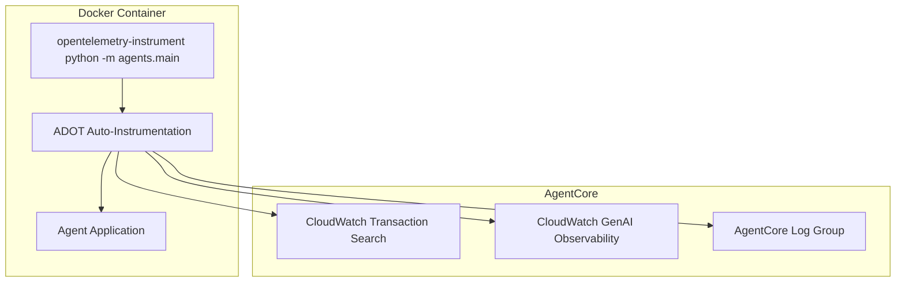

# Design Document

## Overview

This design implements observability and tracing for the agent runtime using AWS Distro for OpenTelemetry (ADOT) auto-instrumentation. Following the AgentCore documentation pattern, the implementation requires only adding the `opentelemetry-instrument` command to the Docker container entrypoint and installing ADOT dependencies. The solution leverages ADOT's automatic instrumentation capabilities with minimal code changes, providing CloudWatch integration and trace correlation through AgentCore's built-in observability features.

## Architecture

### High-Level Architecture



### Component Integration

The design uses ADOT's automatic instrumentation with zero code changes:

1. **ADOT Auto-Instrumentation**: `opentelemetry-instrument` command automatically instruments the Python application
2. **AgentCore Integration**: ADOT automatically integrates with AgentCore's CloudWatch services
3. **Automatic Trace Collection**: No manual trace creation - ADOT handles all instrumentation
4. **Built-in Session Correlation**: AgentCore automatically correlates traces with session IDs

## Components and Interfaces

### 1. Docker Container Configuration

**Purpose**: Enable ADOT auto-instrumentation with minimal changes to the existing container.

**Implementation**:
```dockerfile
# Add ADOT dependency to requirements/agents.txt
# aws-opentelemetry-distro>=0.10.1
# boto3

# Existing uv sync will install it
RUN uv sync --group agents --frozen --no-cache

# Replace existing CMD with auto-instrumentation
CMD ["opentelemetry-instrument", "python", "-m", "agents.main"]
```

**That's it!** ADOT handles everything else automatically.

### 2. Environment Variables

**Purpose**: ADOT works for both local and AgentCore with same setup.

**Local development** (provide existing variables when invoking agent):
```bash
# Existing environment variables
DDB_TABLE=your-table
S3_BUCKET=your-bucket  
SESSION_ID=test-session-123

# ADOT works automatically with these
```

**AgentCore deployment** (automatically configured):
```bash
OTEL_PYTHON_DISTRO=aws_distro
OTEL_PYTHON_CONFIGURATOR=aws_configurator
```


## Data Models

### Automatic Trace Data

**ADOT Auto-Instrumentation** handles all trace data automatically:
- HTTP requests/responses
- Database calls
- Function calls
- Error traces
- Session correlation (already in place)

**Design Rationale**: ADOT captures all relevant data automatically. No custom code needed for POC.

## Error Handling

### Simplified Error Handling Strategy

**Design Rationale**: Requirements emphasize simplicity and minimal code changes. ADOT and Strands provide robust error handling, eliminating need for custom error management layers.

1. **ADOT Auto-Instrumentation**: Built-in error handling and graceful degradation
2. **Strands Telemetry**: Native error isolation within the agent framework  
3. **Minimal Custom Logic**: Avoid complex error handling wrappers to reduce complexity
4. **Standard Logging**: Use existing logging patterns without custom telemetry error handling

### Implementation Approach

- Rely on ADOT's built-in resilience for trace delivery failures
- Use Strands agent's native telemetry error handling
- Maintain backward compatibility with existing BedrockAgentCore integration
- No custom error wrappers to keep implementation minimal

## Testing Strategy

### Simplified Testing Approach

**Design Rationale**: Requirements emphasize simplicity and minimal implementation. ADOT auto-instrumentation works consistently across environments without requiring separate testing strategies.

**Implementation Approach**:
- ADOT auto-instrumentation provides consistent behavior in all environments
- AgentCore's built-in observability features handle trace delivery and correlation
- CloudWatch Transaction Search prerequisite ensures trace visibility
- No custom testing infrastructure needed for POC

## Implementation Approach

### Minimal Implementation

**POC Implementation Tasks**:
1. Add `aws-opentelemetry-distro>=0.10.1` and `boto3` to project dependencies
2. Change Docker CMD from `python -m agents.main` to `opentelemetry-instrument python -m agents.main`
3. Document CloudWatch Transaction Search prerequisite for AgentCore deployment

**That's literally it!** ADOT handles everything else automatically.

## Configuration Management

### Docker Configuration

```dockerfile
# Add ADOT dependencies to requirements/agents.txt:
# aws-opentelemetry-distro>=0.10.1
# boto3

# Existing uv sync installs dependencies
RUN uv sync --group agents --frozen --no-cache

# Use auto-instrumentation entrypoint  
CMD ["opentelemetry-instrument", "python", "-m", "agents.main"]
```

### Environment Variables (Auto-configured by AgentCore)

AgentCore automatically sets:
```bash
OTEL_PYTHON_DISTRO=aws_distro
OTEL_PYTHON_CONFIGURATOR=aws_configurator
```

**No manual configuration needed for POC!**

## Security Considerations

**ADOT handles security automatically** - no custom security implementation needed for POC.

## Performance Considerations  

**ADOT auto-instrumentation has minimal overhead** - no performance tuning needed for POC.

## Monitoring

**Use CloudWatch GenAI Observability dashboard** - automatically populated by ADOT integration.