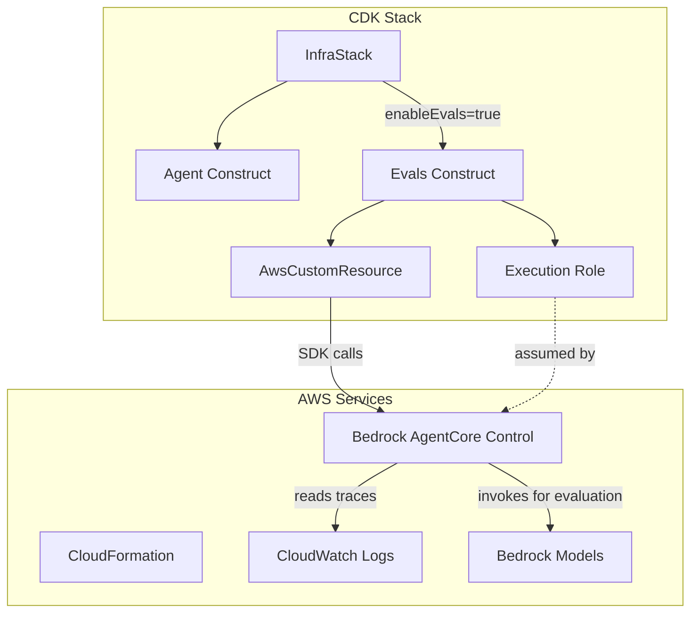

# Design Document: AgentCore Online Evaluations

## Overview

This design describes a temporary CDK Custom Resource implementation for AgentCore Online Evaluations. The solution enables continuous evaluation of the agentic-cost-optimizer agent's performance using Bedrock AgentCore's built-in evaluators. Once the CDK L2 construct (`@aws-cdk/aws-bedrock-agentcore-alpha`) is published to npm, this implementation will be replaced.

The implementation follows the existing project patterns and consists of:
1. Configuration constants in `evals-config.ts`
2. A CDK construct (`Evals`) that creates the execution role and Custom Resource
3. A Python Lambda handler that calls the boto3 API
4. Unit tests using vitest

## Architecture



Note: `AwsCustomResource` is a CDK construct that automatically creates a Lambda function to make AWS SDK calls. We don't need to write a separate Lambda handler.

## Components and Interfaces

### 1. Configuration Constants (`constants/evals-config.ts`)

```typescript
/**
 * Configuration for AgentCore Online Evaluations
 */
export const EvalsConfig = {
  /**
   * Percentage of agent traces to sample for evaluation (0.01-100)
   */
  samplingPercentage: 100,

  /**
   * Minutes of inactivity after which a session is considered complete
   */
  sessionTimeoutMinutes: 5,

  /**
   * Built-in evaluators to apply during online evaluation
   */
  evaluators: [
    'Builtin.ToolSelectionAccuracy',
    'Builtin.ToolParameterAccuracy',
    'Builtin.Correctness',
    'Builtin.Helpfulness',
    'Builtin.Conciseness',
    'Builtin.InstructionFollowing',
    'Builtin.ResponseRelevance',
    'Builtin.Coherence',
    'Builtin.Faithfulness',
    'Builtin.GoalSuccessRate',
  ],

  /**
   * Default endpoint name for AgentCore Runtime
   */
  defaultEndpointName: 'DEFAULT',
} as const;

/**
 * Generate the evaluation config name based on environment
 */
export function getEvalsConfigName(environment: string): string {
  return `cost_optimizer_eval_${environment}`;
}
```

### 2. Evals Construct (`lib/evals.ts`)

The `Evals` class is a CDK construct (similar to the existing `Agent` class in `lib/agent.ts`) that encapsulates all resources needed for online evaluations. It uses `cr.AwsCustomResource` from `aws-cdk-lib/custom-resources` which handles the Lambda creation, CloudFormation response handling, and SDK calls automatically. This is the same approach used in the L2 construct.

```typescript
import * as cr from 'aws-cdk-lib/custom-resources';

export interface EvalsProps {
  /**
   * The Agent construct to evaluate
   */
  agent: Agent;

  /**
   * Environment name (used in config naming)
   */
  environment: string;
}

export class Evals extends Construct {
  /**
   * The execution role for the evaluation service
   */
  public readonly executionRole: iam.IRole;

  /**
   * The evaluation config ID (available after deployment)
   */
  public readonly configId: string;

  /**
   * The evaluation config ARN (available after deployment)
   */
  public readonly configArn: string;

  constructor(scope: Construct, id: string, props: EvalsProps) {
    // Creates execution role with required permissions
    // Creates AwsCustomResource that calls bedrock-agentcore-control APIs
  }
}
```

The `AwsCustomResource` construct:
- Automatically creates a Lambda function to make SDK calls
- Handles CloudFormation response signaling
- Supports onCreate, onUpdate, and onDelete handlers
- Allows specifying IAM policies for the SDK calls
```

### 3. AwsCustomResource Configuration

Since we're using `cr.AwsCustomResource`, we don't need a separate Lambda handler file. The construct handles SDK calls directly:

```typescript
const customResource = new cr.AwsCustomResource(this, 'Resource', {
  resourceType: 'Custom::BedrockAgentCoreOnlineEvaluation',
  installLatestAwsSdk: true,
  onCreate: {
    service: 'bedrock-agentcore-control',
    action: 'CreateOnlineEvaluationConfig',
    parameters: createParams,
    physicalResourceId: cr.PhysicalResourceId.fromResponse('onlineEvaluationConfigId'),
  },
  onUpdate: {
    service: 'bedrock-agentcore-control',
    action: 'UpdateOnlineEvaluationConfig',
    parameters: updateParams,
    physicalResourceId: cr.PhysicalResourceId.fromResponse('onlineEvaluationConfigId'),
  },
  onDelete: {
    service: 'bedrock-agentcore-control',
    action: 'DeleteOnlineEvaluationConfig',
    parameters: {
      onlineEvaluationConfigId: new cr.PhysicalResourceIdReference(),
    },
  },
  policy: cr.AwsCustomResourcePolicy.fromStatements([
    // IAM permissions for SDK calls
  ]),
});
```

### 4. InfraStack Integration

```typescript
export interface InfraStackProps extends StackProps {
  environment: string;
  runtimeVersion: string;
  enableManualTrigger: boolean;
  /**
   * Enable Online Evaluations for the agent
   * @default - true only when environment === 'prod'
   */
  enableEvals?: boolean;
}
```

## Data Models

### Evaluation Config Request (Create)

```typescript
interface CreateOnlineEvaluationConfigRequest {
  onlineEvaluationConfigName: string;
  evaluators: Array<{ evaluatorId: string }>;
  dataSourceConfig: {
    cloudWatchLogs: {
      logGroupNames: string[];
      serviceNames: string[];
    };
  };
  evaluationExecutionRoleArn: string;
  enableOnCreate: boolean;
  rule: {
    samplingConfig: {
      samplingPercentage: number;
    };
    sessionConfig: {
      sessionTimeoutMinutes: number;
    };
  };
  description?: string;
}
```

### Evaluation Config Response

```typescript
interface OnlineEvaluationConfigResponse {
  onlineEvaluationConfigId: string;
  onlineEvaluationConfigArn: string;
  status: string;
  executionStatus: string;
  createdAt: number;
}
```

### Custom Resource Event

```typescript
interface CustomResourceEvent {
  RequestType: 'Create' | 'Update' | 'Delete';
  PhysicalResourceId?: string;
  ResourceProperties: {
    ServiceToken: string;
    // All config passed via environment variables
  };
}
```

### Custom Resource Response

```typescript
interface CustomResourceResponse {
  PhysicalResourceId: string;
  Data: {
    ConfigId: string;
    ConfigArn: string;
  };
}
```

### IAM Permissions Model

```typescript
// Execution Role Trust Policy
interface ExecutionRoleTrustPolicy {
  principal: 'bedrock-agentcore.amazonaws.com';
  conditions: {
    'aws:SourceAccount': string;
    'aws:ResourceAccount': string;
    'aws:SourceArn': string[];  // evaluator/* and online-evaluation-config/*
  };
}

// Execution Role Permissions
interface ExecutionRolePermissions {
  cloudWatchLogsRead: ['logs:DescribeLogGroups', 'logs:GetQueryResults', 'logs:StartQuery'];
  cloudWatchLogsWrite: ['logs:CreateLogGroup', 'logs:CreateLogStream', 'logs:PutLogEvents'];
  cloudWatchIndexPolicy: ['logs:DescribeIndexPolicies', 'logs:PutIndexPolicy'];
  bedrockModel: ['bedrock:InvokeModel', 'bedrock:InvokeModelWithResponseStream'];
}

// Custom Resource Lambda Permissions
interface CustomResourceLambdaPermissions {
  evaluationAdmin: [
    'bedrock-agentcore:CreateOnlineEvaluationConfig',
    'bedrock-agentcore:GetOnlineEvaluationConfig',
    'bedrock-agentcore:UpdateOnlineEvaluationConfig',
    'bedrock-agentcore:DeleteOnlineEvaluationConfig',
    'bedrock-agentcore:ListOnlineEvaluationConfigs',
  ];
  passRole: ['iam:PassRole'];
  cloudWatchIndex: ['logs:DescribeIndexPolicies', 'logs:PutIndexPolicy', 'logs:CreateLogGroup'];
}
```


## Correctness Properties

*A property is a characteristic or behavior that should hold true across all valid executions of a system—essentially, a formal statement about what the system should do. Properties serve as the bridge between human-readable specifications and machine-verifiable correctness guarantees.*

Based on the prework analysis, the following properties can be tested:

### Property 1: Default enableEvals based on environment

*For any* environment string, when `enableEvals` is not explicitly specified, the default value SHALL be `true` if and only if `environment === 'prod'`.

**Validates: Requirements 1.2**

### Property 2: Config name pattern consistency

*For any* valid environment string, the `getEvalsConfigName(environment)` function SHALL return a string matching the pattern `cost_optimizer_eval_{environment}`.

**Validates: Requirements 2.3**

### Property 3: Log group name derivation

*For any* valid runtimeId and endpointName, the derived log group name SHALL match the pattern `/aws/bedrock-agentcore/runtimes/{runtimeId}-{endpointName}`.

**Validates: Requirements 3.2**

### Property 4: Service name derivation

*For any* valid runtimeName and endpointName, the derived service name SHALL match the pattern `{runtimeName}.{endpointName}`.

**Validates: Requirements 3.3**

### Property Reflection

After reviewing the testable properties:
- Properties 2, 3, and 4 are string formatting properties that can be combined conceptually but test different functions
- Property 1 tests conditional logic based on environment
- Most other acceptance criteria are example-based tests (specific CDK template assertions) rather than properties

The remaining acceptance criteria (IAM permissions, resource creation, Lambda behavior) are better suited for example-based unit tests using CDK template assertions and mocking, as they verify specific configurations rather than universal properties.

## Error Handling

### AwsCustomResource Error Handling

The `AwsCustomResource` construct handles errors automatically:
- SDK errors are caught and reported to CloudFormation as FAILED
- The error message is included in the CloudFormation event
- Stack rollback is triggered on failure

### Error Scenarios

| Scenario | Handling |
|----------|----------|
| Invalid config name | SDK raises ValidationException, CloudFormation marks FAILED |
| Missing execution role | SDK raises AccessDeniedException, CloudFormation marks FAILED |
| Config already exists | SDK raises ConflictException, CloudFormation marks FAILED |
| Config not found (Delete) | SDK may raise ResourceNotFoundException, handled gracefully |
| Network timeout | SDK raises timeout error, CloudFormation marks FAILED |

### CDK Construct Error Handling

- If Agent construct is not provided, TypeScript compilation fails
- If environment is not provided, TypeScript compilation fails
- Invalid IAM policy statements are caught by CDK synthesis

## Testing Strategy

### Dual Testing Approach

This feature uses both unit tests and property-based tests:

1. **Unit Tests (vitest)**: Verify specific CDK template assertions and Lambda behavior
2. **Property Tests (fast-check)**: Verify universal properties across all inputs

### Unit Test Coverage

| Test Case | Requirement | Type |
|-----------|-------------|------|
| Evals construct creates Custom Resource when enabled | 1.3 | Example |
| Evals construct does NOT create resources when disabled | 1.4 | Example |
| Config constants have correct values | 2.1, 2.2, 2.4 | Example |
| Execution role has correct trust policy | 4.1, 4.2 | Example |
| Execution role has CloudWatch Logs read permissions | 4.3 | Example |
| Execution role has CloudWatch Logs write permissions | 4.4 | Example |
| Execution role has CloudWatch index policy permissions | 4.5 | Example |
| Execution role has Bedrock model permissions | 4.6 | Example |
| Custom Resource Lambda role has admin permissions | 5.8 | Example |
| Custom Resource Lambda role has PassRole permission | 5.9 | Example |
| Custom Resource Lambda role has index policy permissions | 5.10 | Example |

### Property Test Coverage

| Property | Requirement | Iterations |
|----------|-------------|------------|
| Default enableEvals based on environment | 1.2 | 100 |
| Config name pattern consistency | 2.3 | 100 |
| Log group name derivation | 3.2 | 100 |
| Service name derivation | 3.3 | 100 |

### Test File Structure

```
agentic-cost-optimizer/infra/test/
├── setup.ts                    # Existing test setup
├── evals.spec.ts               # New: Evals construct tests
└── evals-config.spec.ts        # New: Config constants tests
```

### Property Test Configuration

- Library: fast-check (already available in Node.js ecosystem)
- Minimum iterations: 100 per property
- Tag format: `Feature: agentcore-online-evals, Property N: {property_text}`

### Example Property Test

```typescript
import * as fc from 'fast-check';
import { describe, it, expect } from 'vitest';
import { getEvalsConfigName } from '../constants/evals-config';

describe('Evals Config Properties', () => {
  // Feature: agentcore-online-evals, Property 2: Config name pattern consistency
  it('should generate config name matching pattern for any environment', () => {
    fc.assert(
      fc.property(
        fc.stringOf(fc.constantFrom(...'abcdefghijklmnopqrstuvwxyz0123456789_'), { minLength: 1, maxLength: 20 }),
        (environment) => {
          const result = getEvalsConfigName(environment);
          expect(result).toBe(`cost_optimizer_eval_${environment}`);
        }
      ),
      { numRuns: 100 }
    );
  });
});
```
