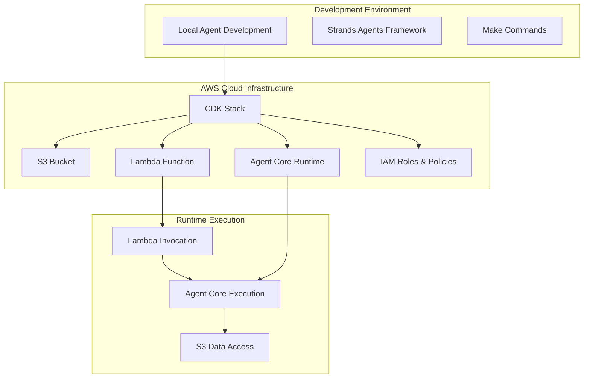

# Design Document

## Overview

The AWS Agent Core Integration feature transforms the existing Strands Agents monorepo into a cloud-native solution that leverages AWS Agent Core runtime for managed agent execution. The design follows a three-tier architecture: infrastructure provisioning (CDK), agent runtime (Agent Core), and invocation layer (Lambda). This approach uses CDK for infrastructure deployment instead of the AgentCore starter toolkit's `agentcore launch` command, providing more control over resource configuration and integration with existing CDK practices. This is a minimal POC focused on core functionality.

## Architecture



The architecture maintains separation of concerns with clear boundaries between development, infrastructure, and runtime components.

## Components and Interfaces

### CDK Infrastructure Stack

**Purpose:** Provisions all AWS resources required for agent deployment and execution.

**Key Components:**
- **S3 Bucket:** Stores agent data with basic configuration
- **ECR Repository:** Stores Docker container images for the agent
- **Agent Core Runtime:** Managed runtime environment for Strands agents
- **Lambda Function:** Serverless invocation layer for agent execution
- **IAM Roles:** Basic access policies for each component

**Configuration Management:**
- Environment variables passed through CDK context and stack parameters
- Resource naming follows consistent patterns using stack name and environment
- Cross-resource references managed through CDK outputs and imports

### Agent Core Runtime Integration

**Purpose:** Hosts the Strands agent in a managed AWS environment with automatic scaling and monitoring.

**Implementation Approach:**
- Use L2 constructs if available, fallback to L1 CloudFormation resources (AWS::BedrockAgentCore::Runtime)
- Follow Strands Agents manual deployment pattern but using CDK instead of boto3
- Runtime configuration through CDK properties and environment variables
- Integration with AWS Bedrock for LLM functionality
- Support for MCP (Model Context Protocol) servers as per Strands framework

**Agent Packaging:**
- Agent code packaged as Docker container and pushed to ECR
- Dependencies managed through requirements.txt export from uv
- Environment-specific configuration injected at runtime

### Lambda Invocation Layer

**Purpose:** Provides a serverless interface for triggering agent execution with proper error handling and response formatting.

**Interface Design:**
```typescript
interface AgentInvocationRequest {
  prompt: string;
  parameters?: Record<string, any>;
  sessionId?: string;
}

interface AgentInvocationResponse {
  response: string;
  sessionId: string;
  executionTime: number;
  status: 'success' | 'error';
  error?: string;
}
```

**Error Handling:**
- Timeout handling for long-running agent operations
- Retry logic for transient failures
- Structured error responses with appropriate HTTP status codes

### Environment Variable Management

**Design Pattern:**
- CDK stack parameters for deployment-time configuration
- Runtime environment variables for agent execution
- Secure parameter passing through AWS Systems Manager Parameter Store for sensitive values

**Variable Flow:**
```
CDK Context → Stack Parameters → Resource Configuration → Runtime Environment
```

## Data Models

### Agent Configuration Model

```python
@dataclass
class AgentConfig:
    runtime_name: str
    s3_bucket_name: str
    bedrock_model_id: str
    timeout_seconds: int = 300
    memory_mb: int = 512
    environment_variables: Dict[str, str] = field(default_factory=dict)
```

### Deployment Artifact Model

```python
@dataclass
class DeploymentArtifact:
    agent_code_path: str
    requirements_path: str
    environment_config: Dict[str, str]
    runtime_version: str
```

## Error Handling

Basic error handling using default CDK and AWS resource behaviors. No custom error handling or monitoring beyond built-in CloudWatch logging where available as default properties.

## Testing Strategy

This is a minimal POC implementation focused on core functionality. Testing will be limited to:

**Manual Validation:**
- CDK deployment verification
- Agent invocation through Lambda console
- S3 bucket access confirmation
- Environment variable printing validation

## Security Considerations

### IAM Security Model

**Basic Permissions:**
- Agent Core runtime with S3 bucket access
- Lambda execution role with basic permissions
- Default encryption and security settings

## Deployment Strategy

### Development Workflow

**Local Development:**
- Existing `make run` command for local testing
- Environment variable simulation for cloud resources

**Cloud Deployment:**
- Manual CDK deployment using `cdk deploy`
- Direct parameter passing through CDK context
- Simple deployment without CI/CD pipeline

### Rollback Strategy

**Infrastructure Rollback:**
- Manual CDK stack rollback using `cdk destroy` and redeploy
- Simple resource recreation for POC environment