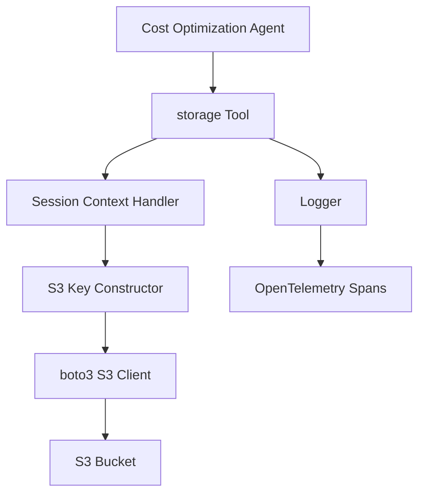

# Design Document

## Overview

This design creates a dedicated Strands tool that encapsulates S3 file writing operations for the cost optimization agent. The `storage()` tool provides a simple interface for saving text files to S3, automatically managing file paths using session context and handling all AWS complexity internally. This approach follows the same pattern as the journaling tool, providing clean separation of concerns and improved maintainability.

The tool automatically retrieves the session ID from the invocation state and leverages `boto3.resource('s3')` for S3 operations, following Strands best practices with comprehensive error handling and logging.

## Architecture

### Storage Tool Architecture



### Design Principles

1. **Simple Interface**: Single `storage()` tool function with clear parameters
2. **Context-Driven Path Management**: Session ID retrieved from invocation state for automatic key prefixing
3. **Comprehensive Logging**: Detailed logging at all stages for observability
4. **Error Handling**: Graceful error handling with structured responses
5. **Type Safety**: Type hints throughout for better IDE support and validation

## Components and Interfaces

### Storage Tool Interface

#### storage(filename, content, tool_context)

Single tool function for writing text files to S3:

**Parameters:**
- `filename` (str): Name of the file to write (e.g., "cost_report.txt", "evidence.txt")
- `content` (str): Text content to write to the file
- `tool_context` (ToolContext): Strands context providing invocation state

**Returns:**
Dictionary with operation results:
```python
# Success
{
    "success": True,
    "s3_uri": "s3://bucket-name/session_id/filename.txt",
    "bucket": "bucket-name",
    "key": "session_id/filename.txt",
    "size_bytes": 12345,
    "timestamp": "2025-01-22T14:30:22Z"
}

# Error
{
    "success": False,
    "error": "Error message with context",
    "bucket": "bucket-name",
    "key": "session_id/filename.txt",
    "timestamp": "2025-01-22T14:30:22Z"
}
```

**Operation Flow:**
1. Retrieve session_id from `tool_context.invocation_state`
2. Retrieve bucket name from environment variable `S3_BUCKET_NAME`
3. Construct S3 key: `{session_id}/{filename}`
4. Encode content as UTF-8 bytes
5. Write to S3 using `put_object()`
6. Return structured response with S3 URI

### boto3 Integration

#### S3 Resource API
```python
import boto3
from botocore.exceptions import ClientError

# Initialize S3 resource
s3 = boto3.resource("s3", region_name=os.environ.get("AWS_REGION", "us-east-1"))
```

#### S3 Put Object Operation
```python
# Get bucket object
bucket = s3.Bucket(bucket_name)

# Put object
bucket.put_object(
    Key=key,
    Body=content.encode('utf-8'),
    ContentType='text/plain'
)
```

#### Error Handling
All S3 operations wrapped in try/except blocks:
- `ClientError`: Extract error code and message for context
- Common error codes: `NoSuchBucket`, `AccessDenied`, `InvalidBucketName`
- Generic `Exception`: Caught for unexpected errors
- No retry logic (relies on boto3 default retries)

### Logging Strategy

#### Logger Configuration
```python
import logging

logger = logging.getLogger(__name__)
```

#### Log Levels and Messages

Following the application's logging pattern with `-->` prefix for operational logs:

**INFO Level:**
- Tool invocation with session and filename
- Successful S3 write operations with URI and size
- Operation completion with metadata

**ERROR Level:**
- S3 operation failures with error codes
- Missing configuration (bucket name, session ID)
- AWS authentication/permission errors

**Example Log Messages:**
```python
logger.info(f"--> Storage tool invoked - Session: {session_id}, File: {filename}")
logger.info(f"--> Successfully wrote {size_bytes} bytes to {s3_uri}")
logger.error(f"--> S3 write failed - Bucket: {bucket}, Key: {key}, Error: {error_code} - {error_message}")
```

## Data Models

### Environment Configuration

**Required Environment Variables:**
- `S3_BUCKET_NAME`: Target S3 bucket for file storage
- `AWS_REGION`: AWS region (defaults to "us-east-1")

**Session Context:**
- `session_id`: Retrieved from `tool_context.invocation_state`

### S3 Key Structure

**Pattern:** `{session_id}/{filename}`

**Examples:**
- `session_20250122_143022/cost_report.txt`
- `session_20250122_143022/evidence.txt`

**Benefits:**
- Natural organization by session
- Easy cleanup of session data
- Simple S3 lifecycle policies by prefix

### File Metadata

**Content Type:** `text/plain`
**Encoding:** UTF-8
**Overwrite Behavior:** Allowed (idempotent operations)

## Error Handling

### Error Strategy

Comprehensive error handling without raising exceptions:
- All S3 operations wrapped in try/except blocks
- `ClientError` exceptions caught and formatted with error code/message
- Generic `Exception` caught for unexpected errors
- Errors returned as structured responses, not raised
- Detailed logging for all error scenarios

### Error Types

Common error scenarios:

1. **Configuration Errors:**
   - `S3_BUCKET_NAME` not set
   - `session_id` not in invocation state

2. **S3 Errors:**
   - `NoSuchBucket`: Bucket doesn't exist
   - `AccessDenied`: Insufficient permissions
   - `InvalidBucketName`: Invalid bucket name format

3. **Validation Errors:**
   - Missing required parameters (filename, content)
   - Empty content string

4. **AWS Errors:**
   - Authentication failures
   - Network connectivity issues
   - Throttling errors

### Error Response Format

Consistent error structure:

```python
{
    "success": False,
    "error": "Detailed error message with context",
    "timestamp": "ISO8601 timestamp",
    "bucket": "bucket-name",  # if available
    "key": "session_id/filename.txt",  # if available
    "error_code": "NoSuchBucket"  # AWS error code if applicable
}
```

### Error Logging

All errors logged with full context:
```python
logger.error(
    f"S3 write failed - Bucket: {bucket}, Key: {key}, "
    f"Error: {error_code} - {error_message}"
)
```

## Testing Strategy

### Unit Tests

Following the journal tool testing pattern with pytest and mocking:

**Test Fixtures:**
```python
@pytest.fixture
def mock_tool_context():
    """Create a mock ToolContext with session_id."""
    context = MagicMock()
    context.invocation_state = {"session_id": "test-session-123"}
    return context

@pytest.fixture
def mock_s3_bucket():
    """Create a mock S3 bucket."""
    bucket = MagicMock()
    bucket.put_object = MagicMock()
    return bucket

@pytest.fixture(autouse=True)
def setup_env():
    """Set up environment variables for tests."""
    os.environ["S3_BUCKET_NAME"] = "test-bucket"
    yield
    if "S3_BUCKET_NAME" in os.environ:
        del os.environ["S3_BUCKET_NAME"]
```

**Test Classes:**

1. **TestStorageSuccess:**
   - Test successful file write with valid parameters
   - Verify S3 bucket.put_object called with correct parameters
   - Verify response contains S3 URI, bucket, key, size, timestamp
   - Verify success field is True

2. **TestStorageMissingConfiguration:**
   - Test with missing session_id in invocation_state
   - Test with missing S3_BUCKET_NAME environment variable
   - Verify error responses with success=False
   - Verify appropriate error messages

3. **TestStorageValidation:**
   - Test with missing filename parameter
   - Test with missing content parameter
   - Test with empty content string
   - Verify validation error responses

4. **TestStorageS3Errors:**
   - Test S3 ClientError scenarios (NoSuchBucket, AccessDenied)
   - Test generic exceptions
   - Verify error responses include error codes and context
   - Verify success field is False

5. **TestStorageKeyConstruction:**
   - Verify correct key format: `{session_id}/{filename}`
   - Test with various filename formats
   - Verify session_id properly prefixed

6. **TestStorageContentEncoding:**
   - Verify UTF-8 encoding applied
   - Verify ContentType set to 'text/plain'
   - Test with special characters and unicode

**Mocking Strategy:**
- Mock `boto3.resource('s3')` to avoid actual AWS calls
- Mock S3 bucket object and put_object method
- Use `@patch` decorator for boto3 resource
- Test internal implementation function directly (without @tool decorator)

## Implementation Notes

### Key Implementation Details

1. **Single Tool Function**: One `@tool` decorated function handles all S3 write operations
2. **Context-Driven Session Management**: Session ID retrieved from `tool_context.invocation_state`
3. **boto3 Resource API**: Uses `boto3.resource("s3")` for cleaner syntax and object-oriented interface
4. **UTF-8 Encoding**: All text content encoded as UTF-8 bytes
5. **Comprehensive Logging**: Logging at DEBUG, INFO, and ERROR levels

### Agent Integration

**Adding to Agent:**
```python
from src.tools import storage

agent = Agent(
    model=bedrock_model,
    system_prompt=SYSTEM_PROMPT,
    tools=[use_aws, journal, storage]
)
```

**Agent Prompt Updates:**
Replace `use_aws` S3 write operations with:
```
Use the storage tool to save files:
- storage(filename="cost_report.txt", content=report_text)
- storage(filename="evidence.txt", content=evidence_text)
```

### AWS Integration

**Permissions Required:**
- `s3:PutObject` on target bucket
- `s3:PutObjectAcl` (if ACLs needed)

**Credential Chain:**
- Environment variables (AWS_ACCESS_KEY_ID, AWS_SECRET_ACCESS_KEY)
- IAM roles (for Lambda/ECS)
- AWS credentials file (~/.aws/credentials)

**boto3 Configuration:**
- Uses default retry configuration (3 attempts, standard mode)
- Respects AWS_REGION environment variable
- No custom timeout configuration (uses boto3 defaults)

## Performance Considerations

### File Size Limits

- **Recommended:** < 5 MB for typical reports
- **S3 Limit:** 5 GB for put_object (single operation)
- **Agent Context:** Reports typically < 1 MB

### Concurrency

- Tool is stateless and thread-safe
- Multiple files can be written concurrently
- S3 handles concurrent writes to different keys

### Cost Optimization

- PUT requests: $0.005 per 1,000 requests
- Storage: $0.023 per GB-month (Standard)
- Typical usage: < 100 requests/month, < 10 MB storage
- Estimated cost: < $0.01/month

## Security Considerations

### Data Protection

- Content transmitted over HTTPS (boto3 default)
- Server-side encryption (S3 default)
- No sensitive data logged (only metadata)

### Access Control

- IAM role-based permissions
- Bucket policies for additional restrictions
- No public access to files

### Audit Trail

- CloudTrail logs all S3 API calls
- Application logs track all operations
- Session ID provides traceability
